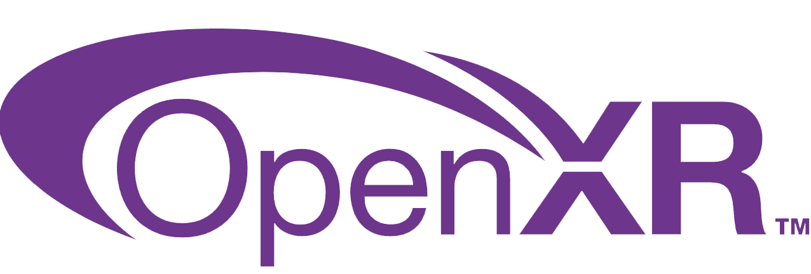
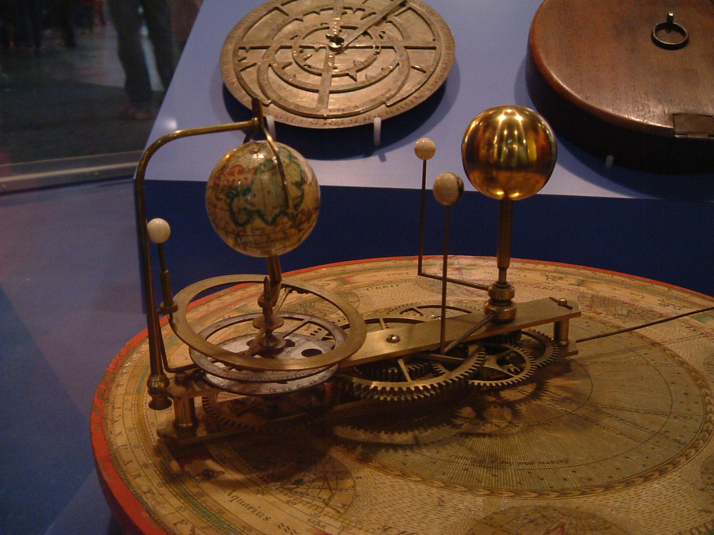

</img>
</img>

 
 

# Getting Started with GodotXR
The making of the VR Demo for the game "Newtons Tether" which is still in development

*Author: Alex Morrell*

**TODO**:
- ALSO NEED TO ENABLE XR TOOLS PLUGIN
- Talk about XR server set up script on RootNode
- Implement teleport using appropriate player body functions

---

### Key Technologies
- [Godot XR Tools](https://docs.godotengine.org/en/stable/tutorials/xr/introducing_xr_tools.html)
- NASA Textures compiled by [Solar System Scope](https://www.solarsystemscope.com/textures/)
- [GDScript](https://docs.godotengine.org/en/stable/tutorials/scripting/gdscript/gdscript_basics.html)

## Game Concept
I have always been facinated by the amazingly intricate complexity of Solar System orreries:

*[Photo](https://www.flickr.com/photos/kaptainkobold/127601212/sizes/m) by Kaptain Kobold*

---

The movement of the celestial bodies in and of itself is mesmerizing.
However there are some clear limitations as a result of being a clockwork construction, the main being it is not dynamic.
The planets are just there, always orbiting on the same plane, with the same period. 

 

We have computers, why settle for gears?

Lets play god.

#### A VR Orbital Playground
The player is positioned as the "architect" of the solar system, with the celestial objects appearing as small spherical bodies.
The sun is roughly the size of a basketball, with earth being baseball sized.

The goal of the game is to put the planet into orbit by slapping the planet with enough force to not fall into the sun, but less than escape velocity. 
Gamification can be achieved by providing hoops positioned around the sun that the planet must fall through (although this has yet to be implemented).

## Development
In this post I will take you though:
- [Initializing a Godot XR Project](#godot-init)
- [Texturing the planets](#planets)
- [XR Tools](#xr-tools)
- [Using Godot's RigidBody physics to simulate orbit (feat. Newton & the Law of Gravitation)](#physics)

#### Godot Init
The project will not be very graphically intensive, so I would like to have the option to build to standalone headsets (e.g. Quest 3.)
So when setting up my project, I made sure to select "Mobile"

Once the project is open, we need to enable Open XR under project settings.

> While I was here, I also changed the 3D physics linear damping to 0. 
> That could be a real ***drag*** on our orbital mechanics!

With that done, we can move on to setting up our scene and textures.

#### Planets

My node tree is pictured below:

##### WorldEnvironment
This node allows me to have a starfield image as our sky box.
Create a new Environment, and within it a new Sky with a Panoramic Sky Material.
I used [this](https://svs.gsfc.nasa.gov/4851) panorama from NASA.
Also disabled Ambient lighting, as we are literally making our own sun.

##### Sun
This node contains the light source for the sun as well as its 3D mesh. For our light source we are using a Omni light so the planet is lit correctly as it orbits around the sun. The sun mesh material is an emission material with a texture from solar system scope.

The important decision you need to make at this point is the scale of the system as a whole, as that will influence your sun size. I found that making the scale human sized (sun size = basket ball) it became much more fun to interact with as orbital periods were much shorter. Another benifit of the small system size is that the velocity of player movements is much more effective at this scale. A simple smack could achieve orbit and observing it was much easier.

This also fits the orrery theme :)

##### EarthRigidBody
This object will be interacted with through the physics system, so we are using a rigid body node. 

The material for the mesh isn't very complex, albedo is from the Earth Day Map, with a specular map and normal map all from solar system scope.

However, Godot's renderer seems to see white as diffuse (the inverse of the map provided)
Another issue is that pure black in the map would create hot spot reflections that were grating. So I inverted the colors and blended the map with a white layer in [Krita](https://krita.org/en/) to address both issues.
 
 

Before:

After:

Last Node needed for Earth is a CollisionShape so the physics engine knows when the rigid body touches something. So a spherical collision shape with the same size as the mesh is added.
[In this section](#physics) we will add a script to the rigid body node to calculate gravitational forces to be applied to the rigid body.
#### XR Tools
XR Tools handles a lot of tedious parts of VR development, it comes with pre-rigged hands that respond to controller grip positions, hand textures, movement functions, etc.

To start you need to download [XR Tools](https://github.com/GodotVR/godot-xr-tools/releases) and extract the archive to an "addons" directory in your godot project.

XR Nodes:

Once that is done, a XROrigin node contains all of the XR related nodes used to represent the player.

The XR camera is the headset of the player, left and right controllers are also represent their namesake.

The cool part is that those nodes automatically are tracked through 3D space, so you can put whatever mesh/collider/whatever node tracked onto the player's hands or head just by making them children of the controller nodes. For this project I am using the rigged physics hands from XR Tools so I don't have to make my own collider.

The hand nodes are actually sub-scenes that can be edited by double clicking them.
I added a skin material also provided with XR Tools so they were not mannequin hands.

##### MovementFlight
A function that allows for free flight provided by XR Tools. Come with a number of cool settings:

For now I am using the headset tilt to control the pitch of flight. This makes it easy to look where you want to go and press forward to go there. The other joystick can be used to turn in place by using a movement_turn function on the other controller.

These movement functions from XR Tools require a PlayerBody node to be a child of the XR Origin. This node has helper functions to determine the direction the player is facing as well as other functions.

I ended up modifying the flight movement script to remove the toggle flight on/off behavior, and added a reset button function that will move the player and planets back to their starting position.
#### Physics